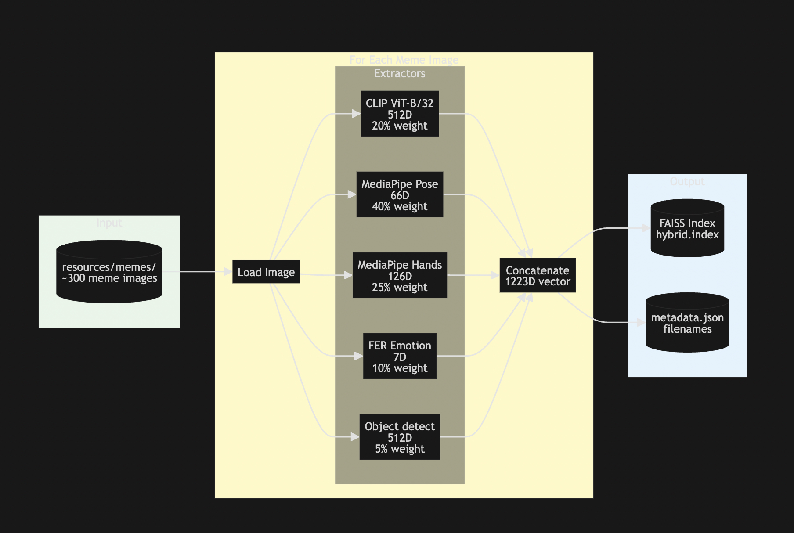
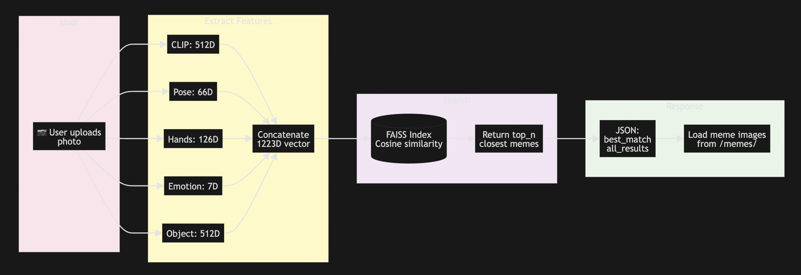

# Are You Meme?

A fun project that matches your face and pose to popular memes using AI. Quickly find the meme that best represents your expression and share it with friends.

## Demo
<p align="center">
  
  <video height="400" controls
         style="display:inline-block; vertical-align:top;">
    <source src="demo/demo.mp4" type="video/mp4">
  </video>
</p>


## How it works
- Snap or upload a photo.
- Compute a compact visual fingerprint using multiple signals:
  - 🏃 Pose (40%): your body posture and position
  - ✋ Hand gestures (25%): thumbs up, peace sign, facepalm, etc.
  - 🖼️ Scene & vibe (20%): background/composition (faces mostly masked)
  - 🙂 Emotion (10%): facial expression
  - 📦 Objects (5%): props and items in frame
- Searches a FAISS index of meme embeddings and return the closest matches.
- Privacy: your photo is processed for matching and not stored.

### Architecture

#### Embedding Generation (Offline)


Pre-process ~300 meme templates: extract CLIP, pose, hands, emotion, and object features. Concatenate into a 1223D vector per meme and build a FAISS index for fast similarity search.

#### Inference (Runtime)


When you upload a photo, we extract the same features, encode into a 1223D vector, and search the FAISS index using cosine similarity. The top matches are returned with scores.

## Setup & Installation

### Backend Setup

1. **Navigate to the backend directory**
   ```bash
   cd backend
   ```

2. **Create a virtual environment** (if it doesn’t already exist)
   ```bash
   python -m venv .venv
   ```

3. **Activate the virtual environment**
   ```bash
   source .venv/bin/activate
   ```

4. **Install dependencies**
   ```bash
   pip install -r requirements.txt
   ```

5. **Run the embedding generation script**
   ```bash
   python scripts/generate_embeddings.py
   ```

### Start the Backend
1. Change to the backend directory and activate the virtual environment:
   ```bash
   cd backend
   source .venv/bin/activate
   ```
2. Run the FastAPI app with Uvicorn:
   ```bash
   uvicorn app:app --reload --host 127.0.0.1 --port 8000
   ```

### Frontend Setup
1. Change to the frontend directory:
   ```bash
   cd frontend
   ```
2. Install dependencies if you haven't already:
   ```bash
   npm install
   ```
3. Start the development server:
   ```bash
   npm run dev
   ```
The frontend will be accessible at `http://localhost:5173` by default.